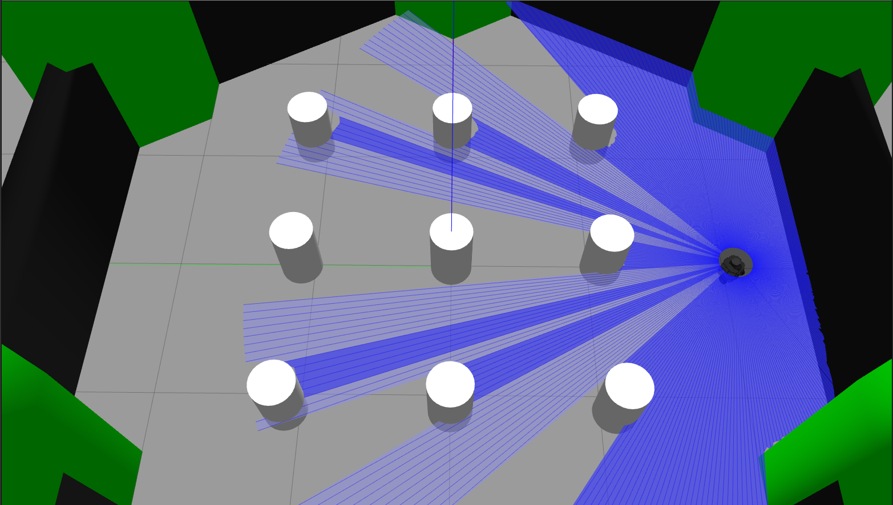
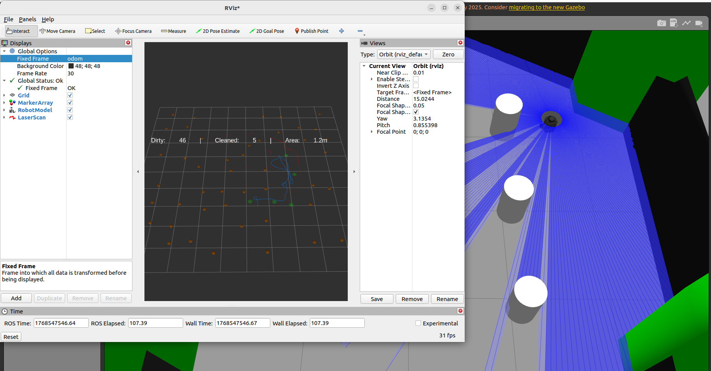
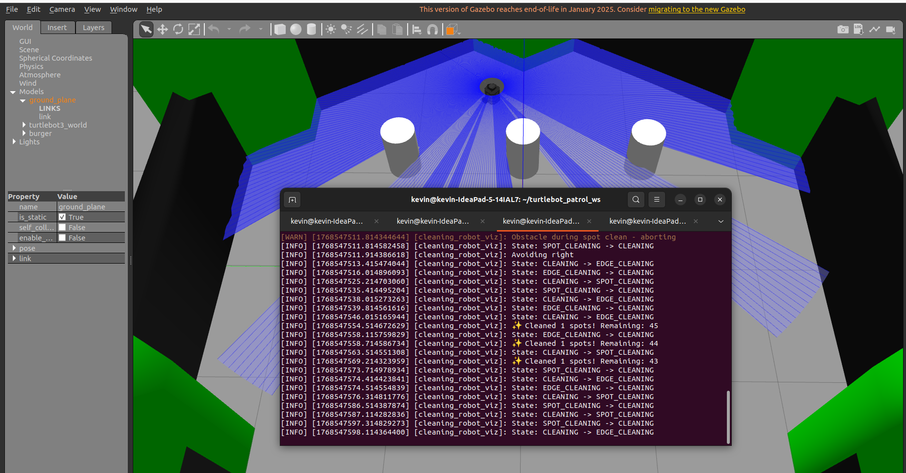
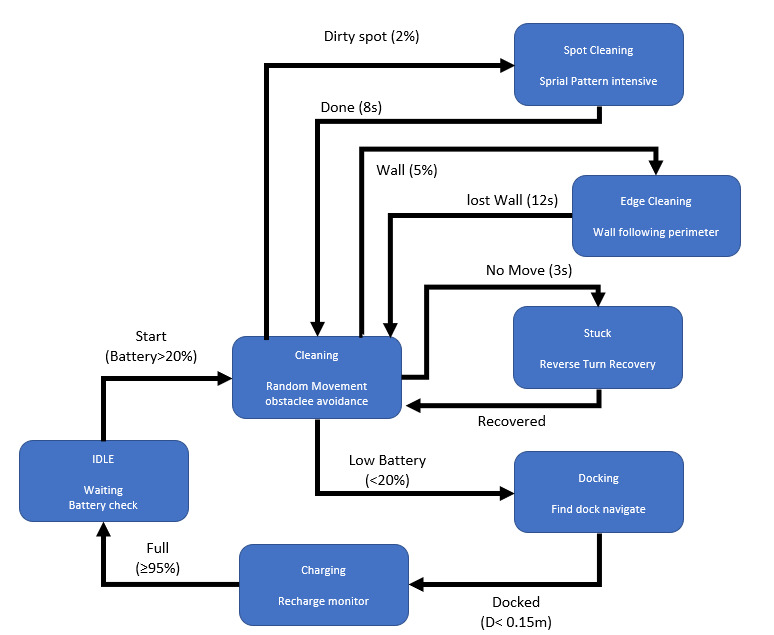

# 🧹 Cleaning Robot FSM - ROS 2 Humble

Autonomous cleaning robot simulation using Finite State Machine (FSM) with real-time visualization in RViz2.


## 🎯 Features

- ✅ **7-State FSM**: IDLE, CLEANING, SPOT_CLEANING, EDGE_CLEANING, STUCK, DOCKING, CHARGING
- ✅ **Intelligent Navigation**: Obstacle avoidance with laser scan
- ✅ **Dust Visualization**: Real-time marker visualization in RViz2
- ✅ **Battery Management**: Automatic docking when battery low
- ✅ **Collision Avoidance**: Safe navigation with emergency stop
- ✅ **Path Tracking**: Visual cleaning path history
- ✅ **Statistics Display**: Real-time cleaning progress

## 🎬 Demo

### Gazebo Simulation


### RViz Visualization


### State Transition Diagram


### Cleaning Visualization
- 🟤 **Brown spheres**: Dirty spots (uncleaned)
- 🟢 **Green circles**: Cleaned areas
- 🔵 **Blue line**: Robot path
- 📊 **Text overlay**: Cleaning statistics

### FSM States
```
IDLE → CLEANING → SPOT_CLEANING → CLEANING
         ↓            (spiral)
         ↓
       EDGE_CLEANING → CLEANING
         ↓         (wall follow)
         ↓
       STUCK → CLEANING
         ↓    (recovery)
         ↓
       DOCKING → CHARGING → IDLE
       (battery)  (recharge)
```

###FLOWCHART


## 🛠️ Requirements

- **OS**: Ubuntu 22.04
- **ROS**: ROS 2 Humble
- **Robot**: TurtleBot3 Burger
- **Simulator**: Gazebo

### Dependencies
```bash
sudo apt update
sudo apt install ros-humble-desktop
sudo apt install ros-humble-turtlebot3*
sudo apt install ros-humble-gazebo-ros-pkgs
```

## 📥 Installation

### 1. Clone Repository
```bash
cd ~
git clone https://github.com/YOUR_USERNAME/cleaning-robot-fsm.git
cd cleaning-robot-fsm
```

### 2. Setup Workspace
```bash
# Create workspace
mkdir -p ~/turtlebot_ws/src
cd ~/turtlebot_ws/src

# Copy package
cp -r ~/cleaning-robot-fsm/cleaning_robot .

# Build
cd ~/turtlebot_ws
colcon build --packages-select cleaning_robot
source install/setup.bash
```

### 3. Environment Setup
```bash
echo "export TURTLEBOT3_MODEL=burger" >> ~/.bashrc
echo "export ROS_DOMAIN_ID=30" >> ~/.bashrc
source ~/.bashrc
```

## 🚀 Usage

### Terminal 1: Launch Gazebo
```bash
export TURTLEBOT3_MODEL=burger
ros2 launch turtlebot3_gazebo turtlebot3_world.launch.py
```

### Terminal 2: Run Cleaning Robot
```bash
source ~/turtlebot_ws/install/setup.bash
ros2 run cleaning_robot cleaning_viz
```

### Terminal 3: Launch RViz for Visualization
```bash
ros2 run rviz2 rviz2
```

**RViz Setup:**
1. Fixed Frame: `odom`
2. Add → **MarkerArray** → Topic: `/cleaning_visualization`
3. Add → **RobotModel**
4. Add → **LaserScan** → Topic: `/scan`

## 📊 Configuration

### Battery Parameters

Edit `cleaning_with_visualization.py`:
```python
self.battery_level = 100.0
self.battery_drain_rate = 0.05      # %/second
self.battery_charge_rate = 2.0      # %/second
self.low_battery_threshold = 30.0   # %
```

### Cleaning Parameters
```python
self.cleaning_speed = 0.12          # m/s
self.angular_speed = 0.4            # rad/s
self.object_detection_threshold = 0.5  # meters
```

### Dock Position
```python
self.dock_position = (0.0, 0.0)  # (x, y) in meters
```

## 🎮 Monitoring

### Battery Level
```bash
ros2 topic echo /battery_level
```

### Cleaning Status
```bash
ros2 topic echo /is_cleaning
```

### Visualization Markers
```bash
ros2 topic echo /cleaning_visualization
```

## 🔧 Troubleshooting

### Robot Colliding with Walls

Increase obstacle detection threshold:
```python
self.object_detection_threshold = 0.6  # from 0.5
```

### Docking Failure

Increase docking tolerance:
```python
if distance < 0.25:  # from 0.2
    self.change_state(State.CHARGING)
```

### Battery Draining Too Fast

Reduce drain rate:
```python
self.battery_drain_rate = 0.03  # from 0.05
```

## 📖 State Transitions

| From State      | To State       | Condition                    | Duration |
|-----------------|----------------|------------------------------|----------|
| IDLE            | CLEANING       | Timer > 3s, Battery > 30%    | 3s       |
| CLEANING        | SPOT_CLEANING  | Random (2% chance)           | ~8s      |
| CLEANING        | EDGE_CLEANING  | Wall detected (5% chance)    | ~12s     |
| CLEANING        | STUCK          | No movement for 3s           | 3s       |
| CLEANING        | DOCKING        | Battery < 30%                | Variable |
| DOCKING         | CHARGING       | Distance to dock < 0.2m      | Variable |
| CHARGING        | IDLE           | Battery ≥ 90%                | ~30s     |
| SPOT_CLEANING   | CLEANING       | Spiral complete or timeout   | ~8s      |
| EDGE_CLEANING   | CLEANING       | Lost wall or timeout         | ~12s     |
| STUCK           | CLEANING       | Recovery complete            | 3s       |

## 📁 Project Structure
```
cleaning_robot/
├── cleaning_robot/
│   ├── __init__.py
│   ├── cleaning_fsm.py                    # Original FSM (no viz)
│   └── cleaning_with_visualization.py      # FSM with dust visualization
├── resource/
│   └── cleaning_robot
├── test/
├── package.xml
└── setup.py
```

## 📚 Documentation

- [State Transition Diagram](docs/cleaning_robot_flowchart.png)
- [Detailed Flowchart](docs/cleaning_robot_detailed.png)
- [ASCII Flowchart](docs/cleaning_robot_ascii_art.txt)

## 🤝 Contributing

Contributions are welcome! Please feel free to submit a Pull Request.

1. Fork the repository
2. Create your feature branch (`git checkout -b feature/AmazingFeature`)
3. Commit your changes (`git commit -m 'Add some AmazingFeature'`)
4. Push to the branch (`git push origin feature/AmazingFeature`)
5. Open a Pull Request

## 📝 License

This project is licensed under the Apache License 2.0 - see the [LICENSE](LICENSE) file for details.

## 🙏 Acknowledgments

- ROS 2 Humble
- TurtleBot3 by ROBOTIS
- Gazebo Simulator

## 👤 Author

**Kevin**

- GitHub: [@YOUR_USERNAME](https://github.com/YOUR_USERNAME)

## 📧 Contact

For questions or suggestions, please open an issue on GitHub.

---

**⭐ If you found this project helpful, please give it a star!**
